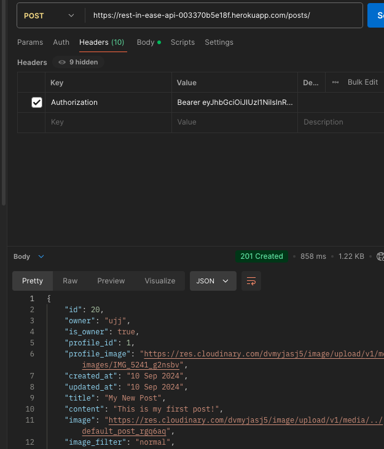

# The API for Rest in Ease

## Table of Contents

- [Introduction](#introduction)
- [Purpose and goals](#purpose-and-goals)
- [API Integration](#api-integration)
  - [API Endpoints](#api-endpoints)
  - [Crud functionality](#crud-functionality)
- [Agile Methodology](#agile-methodology)
- [Frontend](#frontend)
- [Database](#database)
  - [Erd](#erd)
  - [Models](#models)
- [Testing](#testing)
  - [Valdidation](#validation)
- [Set Up and deployment](#set-up-and-deployment)
  - [Version Control](#version-control)
  - [Set Up Django](#set-up-django)
  - [Deploy to Heroku](#deploy-to-heroku)
- [Technologies Used](#technologies)
  - [Languages](#languages)
  - [Tools](#tools)
  - [Libraries and Frameworks](#libraries)

## <a id="introduction">Introduction</a>

The Rest In Ease API is designed to manage user-generated content such as posts and comments, allowing users to express their emotions and categorize their content. Currently, certain fields like mood, category, and feeling are hardcoded in both the frontend and backend due to time constraints. In the frontend, these fields are placed in separate files as a compromise to maintain modularity. However, in future iterations, these fields will be fully integrated into the backend models, enabling more flexibility and easier updates. This temporary solution was implemented to meet the project deadline, and enhancing this functionality is a planned improvement.

## <a id="purpose-and-goals">Purpose and goals</a>

## <a id="api-integration">API Integration</a>

The API is integrated with the frontend using Django Rest Framework

### <a id="api-endpoints">API Endpoints</a>

The API has the following endpoints:

End Points

| **HTTP Method** | **Endpoint**                            | **Description**                                   | **Authentication Required** |
| --------------- | --------------------------------------- | ------------------------------------------------- | --------------------------- |
| **POST**        | `/dj-rest-auth/login/`                  | Log in and receive access and refresh tokens.     | No                          |
| **POST**        | `/dj-rest-auth/logout/`                 | Log out the user and invalidate tokens.           | Yes                         |
| **POST**        | `/dj-rest-auth/registration/`           | Register a new user account.                      | No                          |
| **POST**        | `/dj-rest-auth/password/reset/`         | Send a password reset email.                      | No                          |
| **POST**        | `/dj-rest-auth/password/reset/confirm/` | Confirm and reset the password using token.       | No                          |
| **POST**        | `/dj-rest-auth/token/refresh/`          | Refresh the access token using the refresh token. | Yes                         |

### Post Endpoints

| **HTTP Method** | **Endpoint**       | **Description**                         | **Authentication Required** |
| --------------- | ------------------ | --------------------------------------- | --------------------------- |
| **GET**         | `/posts/`          | Retrieve a list of posts.               | No                          |
| **POST**        | `/posts/`          | Create a new post.                      | Yes                         |
| **GET**         | `/posts/<int:pk>/` | Retrieve a single post by ID.           | No                          |
| **PUT**         | `/posts/<int:pk>/` | Update a post if the user is the owner. | Yes                         |
| **DELETE**      | `/posts/<int:pk>/` | Delete a post if the user is the owner. | Yes                         |

### Comment Endpoints

| **HTTP Method** | **Endpoint**          | **Description**                            | **Authentication Required** |
| --------------- | --------------------- | ------------------------------------------ | --------------------------- |
| **GET**         | `/comments/`          | Retrieve a list of comments.               | No                          |
| **POST**        | `/comments/`          | Create a new comment.                      | Yes                         |
| **GET**         | `/comments/<int:pk>/` | Retrieve a single comment by ID.           | No                          |
| **PUT**         | `/comments/<int:pk>/` | Update a comment if the user is the owner. | Yes                         |
| **DELETE**      | `/comments/<int:pk>/` | Delete a comment if the user is the owner. | Yes                         |

### Like Endpoints

| **HTTP Method** | **Endpoint**       | **Description**               | **Authentication Required** |
| --------------- | ------------------ | ----------------------------- | --------------------------- |
| **GET**         | `/likes/`          | Retrieve a list of likes.     | No                          |
| **POST**        | `/likes/`          | Like a post.                  | Yes                         |
| **GET**         | `/likes/<int:pk>/` | Retrieve a single like by ID. | No                          |
| **DELETE**      | `/likes/<int:pk>/` | Unlike a post.                | Yes                         |

### Follower Endpoints

| **HTTP Method** | **Endpoint**           | **Description**                          | **Authentication Required** |
| --------------- | ---------------------- | ---------------------------------------- | --------------------------- |
| **GET**         | `/followers/`          | Retrieve a list of followers.            | No                          |
| **POST**        | `/followers/`          | Follow another user.                     | Yes                         |
| **GET**         | `/followers/<int:pk>/` | Retrieve a single follower record by ID. | No                          |
| **DELETE**      | `/followers/<int:pk>/` | Unfollow a user.                         | Yes                         |

### Profile Endpoints

| **HTTP Method** | **Endpoint**          | **Description**                            | **Authentication Required** |
| --------------- | --------------------- | ------------------------------------------ | --------------------------- |
| **GET**         | `/profiles/`          | Retrieve a list of profiles.               | No                          |
| **GET**         | `/profiles/<int:pk>/` | Retrieve a single profile by ID.           | No                          |
| **PUT**         | `/profiles/<int:pk>/` | Update a profile if the user is the owner. | Yes                         |

### <a id="crud-functionality">Crud functionality</a>
The API for the Rest In Ease application provides full CRUD (Create, Read, Update, Delete) functionality for the following models:

Click to see Crud

1.	Posts
  - Create: Users can create new posts, including text content, images, moods, and categories.
	- Read: Posts are retrievable via API endpoints for listing all posts or fetching individual posts.
	- Update: Users can update the content, mood, and category of their existing posts.
	- Delete: Users can delete their posts, removing them from the platform.
2.	Comments
	-  Create: Authenticated users can create comments on posts.
	- Read: Comments for specific posts are retrievable via API endpoints.
	- Update: Users can edit their comments.
	- Delete: Users can delete their comments, removing them from a post.
3.	Likes
	- Create: Users can like posts, marking them as liked in the database.
	- Read: The API allows fetching which posts have been liked by users.
	- Delete: Users can remove their likes from posts.
4.	Profiles
	- Create: User profiles are created automatically upon user registration.
	- Read: Profiles can be retrieved via API, including profile details and user-generated content.
	- Update: Users can update their profile information, such as bio and profile image.
	- Delete: Profiles are not directly deletable, as the application does not provide user account deletion.
5.	Followers
	- Create: Users can follow other profiles, creating a following relationship.
	- Read: Follower and following lists are retrievable via API for a given profile.
	- Delete: Users can unfollow profiles, removing the following relationship.

Each model follows the standard REST conventions for CRUD operations, ensuring that users can interact with the application seamlessly through the front-end.

## <a id="agile-methodology">Agile Methodology</a>

The project was developed using Agile methodology. The kanban board is available [here](https://github.com/users/JorgenDIF/projects/7) 

## <a id="frontend">Frontend</a>

The frontend is a React app that is connected to the API. The repo can be found here:
[Frontend](https://github.com/JorgenDIF/pp5-frontend)

## <a id="database">Database</a>

### <a id="erd">Erd</a>

The ERD for the project:

Click to see ERD

### <a id="models">Models</a>

The models for the project are as follows:

- User
- Profile
- Followers
- Likes
- Comments
- Posts

I followed the walthrough from Code Institute to create the models but I customized 2 of them to suit my project. The models are as follows:

- Posts: I added a field called mood to the posts model to allow users to add their mood to their posts. I also added a field called category to the posts model to allow users to categorize their posts. During the development process, I initially hardcoded mood and category fields directly into the Post model, but I later realized that a more dynamic approach would have been better. This realization came as I noticed how reusable and flexible separate models for these fields could be across the application. Unfortunately, due to time constraints, I didn’t implement this solution at the time. However, I plan to refactor the current setup to create dedicated models for mood and category in the future, which is part of my future features roadmap.
- 	Comments: For the comments, I followed a similar approach by adding a feeling field directly into the Comment model to allow users to express their emotions. During the development process, I realized that creating a separate Feeling model would have been a more dynamic and reusable solution across different parts of the application. However, due to time constraints, I integrated it directly. I plan to refactor this in the future for improved scalability by implementing a dedicated Feeling model. This refactor is part of my future development roadmap.
## <a id="testing">Testing</a>

I tested endpoints using postman:

Login

- Login: Tested the login functionality to authenticate a user

Create a Post

- Create a Post: Verified the ability to create a new post 

Get a Post

- Get a Post: Retrieved details of a specific post by its ID

Update a Post

- Update a Post: Tested updating an existing post

Delete a Post

- Delete a Post: Verified the deletion of a post 

Like a Post

- Like a Post: Tested liking a post and validating the response 

Follow a User

- Follow a User: Ensured that a user can follow another user 

Get followers for a User

- Get Followers for a User: Retrieved the list of followers for a specific user 

Add a Comment

- Add a Comment: Tested the functionality for adding comments to posts 

Get Comments

- Get Comments: Retrieved the list of comments on a specific post
 

 

 ## <a id="validation">Validation</a>

### PEP8 Validation

- The project follows PEP8 guidelines, and Autopep8 has been configured as the default Python formatter. After running the validation, no PEP8 errors were found in the code, ensuring that the project adheres to Python’s style guide for clean and consistent code.

## <a id="set-up-and-deployment">Set Up and deployment</a>

To set up and deploy the project, follow the steps below:

### <a id="version-control">Version Control</a>

Version Control

 
The site was created using the Gitpod editor and pushed to github to the remote repository ‘pixavibe-frontend’.
The following git commands were used throughout development to push code to the remote repo:

- `git add <file>` - This command was used to add the file(s) to the staging area before they are committed.
- `git commit -m “commit message”` - This command was used to commit changes to the local repository queue ready for the final step.
- `git push` - This command was used to push all committed code to the remote repository on github.

### <a id="set-up-django">Set Up Django</a>

To set up Django, run the following command:

Click to see how to set up Django

- Install Django by running the command pip install django.
- Create a new Django project using django-admin startproject projectname.
- Navigate to the project folder with cd projectname.
- Create a new app within your Django project using python manage.py startapp appname.
- Add your new app to the INSTALLED_APPS section in settings.py.
- Run initial migrations to set up the database by using python manage.py migrate.
- Start the development server by running python manage.py runserver.
- Open your browser and go to http://127.0.0.1:8000/ to see your Django project running locally.

 

### <a id="deploy-to-heroku">Deploy to Heroku</a>

Click to see how deploy to Heroku

Deployment Instructions

Set Up in Gitpod (or your preferred IDE)

1.	Create a new workspace in your IDE. For this project, Gitpod was used.
2.	Set up your Django REST Framework project by following the Django REST Framework guide.

**Project Settings**

- Add https://<your_app_name>.herokuapp.com to the ALLOWED_HOSTS and CSRF_TRUSTED_ORIGINS lists in the settings.py file.
- Ensure that your environment variables (DATABASE_URL, SECRET_KEY, and CLOUDINARY_URL) are set to use os.environ.get("<variable_name>") to pull values from environment settings.
- If changes have been made to static files or apps, run collectstatic or migrate as needed.
- Commit and push the changes to your repository.

**Procfile and Requirements**

- Create a file called Procfile at the root of your project and add:
- release: python manage.py makemigrations && python manage.py migrate
- web: gunicorn drf_api.wsgi
- In your terminal, create a requirements.txt file by running: pip3 freeze > requirements.txt.
- Optionally, create a runtime.txt to specify your Python version (e.g., python-3.11.9).
- Commit and push these changes to your repository.

**Deployment to Heroku**

1.	Log in to your Heroku account and create a new app with a unique name, selecting the correct region.
2.	In the Settings tab, configure Config Vars:
- DATABASE_URL: Link to your database.
- SECRET_KEY: A secret key for your project.
- CLOUDINARY_URL: Link to your Cloudinary account.
- ALLOWED_HOSTS: The URL of your Heroku app.
- CLIENT_ORIGIN: The URL of your deployed frontend.
- CLIENT_ORIGIN_DEV: The URL of your local development frontend.
3.	In the Deploy tab:
- Select GitHub as the deployment method, search for your repository, and connect to it.
- To manually deploy, click Deploy Branch.
- Ensure that DEBUG is set to False for production.
- After a successful build, a message will confirm that Your app was successfully deployed. You can view the live site by clicking the View button.

## <a id="technologies">Technologies Used</a>

### <a id="languages">Languages Used</a>

- Python: The primary language used to build the backend API.

### <a id="tools">Tools Used</a>

Click to see Tools used

- GitPod Enterprise: A cloud-based development environment used for coding and testing. I switched from VS Code to GitPod during the project to better utilize Tutor Support.
- Lucidchart: Used for creating the Entity-Relationship Diagram (ERD) to visualize the database schema and relationships between models.
- Git: For version control, managing the history of your codebase.
- GitHub: For hosting the repository and tracking the development process.
- Heroku: The cloud platform used for deploying and hosting your application.
- PostgreSQL: The database system used in your application, managed through Heroku.
- Cloudinary: For media storage (image hosting and serving).

### <a id="libraries">Libraries and Frameworks</a>

Click to see how Libraries and Frameworks

**Django and REST Framework:**

- Django==3.2.25: The core framework used to build your API.
- djangorestframework==3.14.0: For creating the API endpoints and handling serialization, views, and permissions.

**Authentication and Security:**

- dj-rest-auth==2.1.9: Provides ready-to-use endpoints for user authentication, including login and registration.
- djangorestframework-simplejwt==4.7.2: For JWT-based authentication.
- django-allauth==0.54.0: For managing user authentication and registration flows.

**Database Management:**

- dj-database-url==0.5.0: For handling database configurations.
- psycopg2-binary==2.9.9: PostgreSQL database adapter for Django.

**Storage and Media:**

- django-cloudinary-storage==0.3.0: For storing and serving media files using Cloudinary.
- Pillow==10.3.0: For image processing and manipulation.

**Other Utilities:**

- django-cors-headers==4.3.1: To handle cross-origin resource sharing between your frontend and backend.
- gunicorn==22.0.0: The WSGI HTTP server to run your application in production.

**Networking and Requests:**

- requests==2.32.3: For making HTTP requests when needed.

