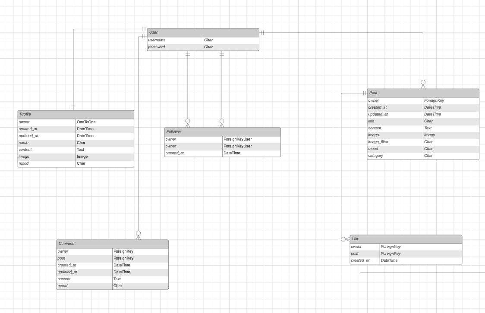

# The API for Rest in Ease

## Table of Contents

- [Introduction](#introduction)
- [Purpose and goals](#purpose-and-goals)
- [API Integration](#api-integration)
  - [API Endpoints](#api-endpoints)
  - [Crud functionality](#crud-functionality)
- [Agile Methodology](#agile-methodology)
- [Frontend](#frontend)
- [Database](#database)
  - [Erd](#erd)
  - [Models](#models)
- [Testing](#testing)
- [Set Up and deployment](#set-up-and-deployment)
  - [Set Up Virtual Environment](#set-up-virtual-environment)
  - [Set Up Database](#set-up-database)
  - [Set Up Django](#set-up-django)
  - [Set Up Django Rest Framework](#set-up-django-rest-framework)
  - [Deploy to Heroku](#deploy-to-heroku)
- [Connect to Frontend](#connect-to-frontend)
- [Security](#security)
  - [Environment Variables](#environment-variables)

## <a id="introduction">Introduction</a>

This is the API for Rest in Ease. It is a Django Rest Framework API that is connected to a React frontend

## <a id="purpose-and-goals">Purpose and goals</a>

## <a id="api-integration">API Integration</a>

The API is integrated with the frontend using Django Rest Framework

### <a id="api-endpoints">API Endpoints</a>

The API has the following endpoints:

End Points

| **HTTP Method** | **Endpoint**                            | **Description**                                   | **Authentication Required** |
| --------------- | --------------------------------------- | ------------------------------------------------- | --------------------------- |
| **POST**        | `/dj-rest-auth/login/`                  | Log in and receive access and refresh tokens.     | No                          |
| **POST**        | `/dj-rest-auth/logout/`                 | Log out the user and invalidate tokens.           | Yes                         |
| **POST**        | `/dj-rest-auth/registration/`           | Register a new user account.                      | No                          |
| **POST**        | `/dj-rest-auth/password/reset/`         | Send a password reset email.                      | No                          |
| **POST**        | `/dj-rest-auth/password/reset/confirm/` | Confirm and reset the password using token.       | No                          |
| **POST**        | `/dj-rest-auth/token/refresh/`          | Refresh the access token using the refresh token. | Yes                         |

### Post Endpoints

| **HTTP Method** | **Endpoint**       | **Description**                         | **Authentication Required** |
| --------------- | ------------------ | --------------------------------------- | --------------------------- |
| **GET**         | `/posts/`          | Retrieve a list of posts.               | No                          |
| **POST**        | `/posts/`          | Create a new post.                      | Yes                         |
| **GET**         | `/posts/<int:pk>/` | Retrieve a single post by ID.           | No                          |
| **PUT**         | `/posts/<int:pk>/` | Update a post if the user is the owner. | Yes                         |
| **DELETE**      | `/posts/<int:pk>/` | Delete a post if the user is the owner. | Yes                         |

### Comment Endpoints

| **HTTP Method** | **Endpoint**          | **Description**                            | **Authentication Required** |
| --------------- | --------------------- | ------------------------------------------ | --------------------------- |
| **GET**         | `/comments/`          | Retrieve a list of comments.               | No                          |
| **POST**        | `/comments/`          | Create a new comment.                      | Yes                         |
| **GET**         | `/comments/<int:pk>/` | Retrieve a single comment by ID.           | No                          |
| **PUT**         | `/comments/<int:pk>/` | Update a comment if the user is the owner. | Yes                         |
| **DELETE**      | `/comments/<int:pk>/` | Delete a comment if the user is the owner. | Yes                         |

### Like Endpoints

| **HTTP Method** | **Endpoint**       | **Description**               | **Authentication Required** |
| --------------- | ------------------ | ----------------------------- | --------------------------- |
| **GET**         | `/likes/`          | Retrieve a list of likes.     | No                          |
| **POST**        | `/likes/`          | Like a post.                  | Yes                         |
| **GET**         | `/likes/<int:pk>/` | Retrieve a single like by ID. | No                          |
| **DELETE**      | `/likes/<int:pk>/` | Unlike a post.                | Yes                         |

### Follower Endpoints

| **HTTP Method** | **Endpoint**           | **Description**                          | **Authentication Required** |
| --------------- | ---------------------- | ---------------------------------------- | --------------------------- |
| **GET**         | `/followers/`          | Retrieve a list of followers.            | No                          |
| **POST**        | `/followers/`          | Follow another user.                     | Yes                         |
| **GET**         | `/followers/<int:pk>/` | Retrieve a single follower record by ID. | No                          |
| **DELETE**      | `/followers/<int:pk>/` | Unfollow a user.                         | Yes                         |

### Profile Endpoints

| **HTTP Method** | **Endpoint**          | **Description**                            | **Authentication Required** |
| --------------- | --------------------- | ------------------------------------------ | --------------------------- |
| **GET**         | `/profiles/`          | Retrieve a list of profiles.               | No                          |
| **GET**         | `/profiles/<int:pk>/` | Retrieve a single profile by ID.           | No                          |
| **PUT**         | `/profiles/<int:pk>/` | Update a profile if the user is the owner. | Yes                         |

### <a id="crud-functionality">Crud functionality</a>

The API has CRUD functionality for the following models:

## <a id="agile-methodology">Agile Methodology</a>

The project was developed using Agile methodology

## <a id="frontend">Frontend</a>

The frontend is a React app that is connected to the API

## <a id="database">Database</a>

### <a id="erd">Erd</a>

The ERD for the project:

Click to see ERD

### <a id="models">Models</a>

The models for the project are as follows:

- User
- Profile
- Followers
- Likes
- Comments
- Posts

I followed the walthrough from Code Institute to create the models but I customized 2 of them to suit my project. The models are as follows:

- Posts : I added a field called mood to the posts model to allow users to add their mood to their posts. I also added a field called category to the posts model to allow users to categorize their posts. Initially, I had planned to create category as a separate general model to make it more dynamic and reusable across different parts of the application. However, due to time constraints, I had to add it directly as a field in the posts model. This is something I plan to refactor in the future to implement a more scalable solution by having a dedicated model for categories. This enhancement is included in my future features roadmap.
- Comments : I added a field called feeling to the comments model to allow users to add their mood to their comments.

## <a id="testing">Testing</a>

I tested endpoints using postman:

Login

- Login: Tested the login functionality to authenticate a user

Create a Post

- Create a Post: Verified the ability to create a new post 

Get a Post

- Get a Post: Retrieved details of a specific post by its ID

Update a Post

- Update a Post: Tested updating an existing post

Delete a Post

- Delete a Post: Verified the deletion of a post 

Like a Post

- Like a Post: Tested liking a post and validating the response 

Follow a User

- Follow a User: Ensured that a user can follow another user 

Get followers for a User

- Get Followers for a User: Retrieved the list of followers for a specific user 

Add a Comment

- Add a Comment: Tested the functionality for adding comments to posts 

Get Comments

- Get Comments: Retrieved the list of comments on a specific post
 

 

## <a id="set-up-and-deployment">Set Up and deployment</a>

To set up and deploy the project, follow the steps below:

### <a id="set-up-virtual-environment">Set Up Virtual Environment</a>

To set up the virtual environment, run the following command:

### <a id="set-up-database">Set Up Database</a>

To set up the database, run the following command:

### <a id="set-up-django">Set Up Django</a>

To set up Django, run the following command:

### <a id="set-up-django-rest-framework">Set Up Django Rest Framework</a>

To set up Django Rest Framework, run the following command:

## <a id="connect-to-frontend">Connect to Frontend</a>

To connect to the frontend, run the following command:

## <a id="security">Security</a>

### <a id="environment-variables">Environment Variables</a>

The following environment variables are used in the project:
